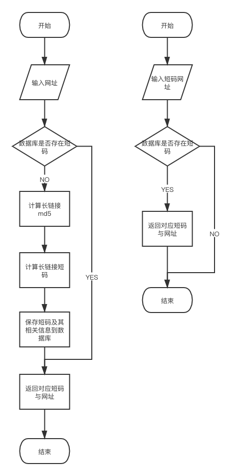
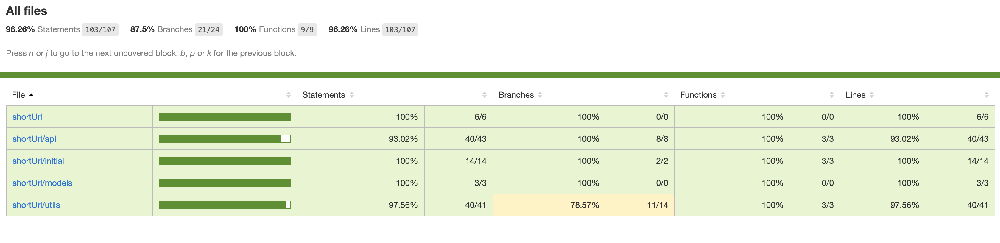

#### 项目

##### npm start

启动项目

Server running on http://localhost:8080

##### npm test

自动化测试

##### npm run cover

自动化测试并计算覆盖率

#### 设计

##### 设计流程图

左边为「长链接转短链接」
右边为「短链接转长链接」



##### schema

在文件夹【model】中

#Url

```

_id: String [长链接url的md5编码]
url: String [原来的长链接]
code: String [短链接code id]

```

##### 长链接转短链接

```
1、将长链接进行md5编码
2、判断该md5在数据库中是否存在，如果存在则直接返回对应短链接
3、若不存在通过短链生成算法获取短链接
4、将md5值当作_id,与url和code字段存入数据库中，再返回对应短链接


# shortId 算法

1、使用当前的进程工作id进行62进制转换位字符串
2、通过当前服务器时间与一个时间的差值，如果该差值有相同，获取0～61中的随机数字进行62进制转换
3、通过该差值进行62进制转换字符串连接
4、如果当前字符串进过前三部连接没有超过6位，则随机补气其余位数

```

##### 短链接转长链接

```
1、获取请求链接中的短链接code id
2、从数据库中查询该code id是否存在，若不存在则报404错误
3、若存在则返回对应长链接id
```

#### 可能与扩展

```
1、将来可能扩展用户自定义的短链
2、数据统计（访问的 ip 地域、用户使用的设备、点击的次数等等）
3、后台管理删除，过期时间等等
4、短链访问权限管理（输密码、登陆访问等等）
5、...

```

#### 测试结果


```
  test/api/index.test.js 测试接口/index
    ✓ 不传短码param /
    ✓ 不存在这个短码 /123456789
    ✓ 存在这个短码

  test/api/short-id.test.js /api/url/:code 接口测试
    参数类型正常
      ✓ 存在传入短码 
      ✓ 不存在短码
    参数类型不正常或不存在 404
      ✓ 不传参数code
      ✓ code传特殊字符串
    并发
      ✓ code参数为特殊字符并且数据库中不存在，并发1000次请求 (998ms)

  test/api/short-id.test.js /api/shortId?url=${url} 接口测试
    参数类型正常
      ✓ 存在该长链接
      ✓ 不存该长链接
    参数类型不正常或不存在
      ✓ 参数类型不是链接
      ✓ 不传参数url

  test/utils/md5.test.js
    字符串为空的情况
      ✓ 字符串为""
      ✓ 字符串为null
      ✓ 字符串为undefined
      ✓ 字符串为NaN
    str参数不为空
      ✓ 字符串为 8186070182004967

  test/utils/shortId.test.js
    ✓ 生成shortId
    ✓ 重复10000次不会重复 (45ms)

  19 passing (1s)

```
```
---------------------|---------|----------|---------|---------|-------------------
File                 | % Stmts | % Branch | % Funcs | % Lines | Uncovered Line #s 
---------------------|---------|----------|---------|---------|-------------------
All files            |   96.26 |     87.5 |     100 |   96.26 |                   
 shortUrl            |     100 |      100 |     100 |     100 |                   
  app.js             |     100 |      100 |     100 |     100 |                   
 shortUrl/api        |   93.02 |      100 |     100 |   93.02 |                   
  index.js           |   91.67 |      100 |     100 |   91.67 | 15                
  shortId.js         |   93.55 |      100 |     100 |   93.55 | 36,56             
 shortUrl/initial    |     100 |      100 |     100 |     100 |                   
  apiInitial.js      |     100 |      100 |     100 |     100 |                   
  index.js           |     100 |      100 |     100 |     100 |                   
  mongoInitial.js    |     100 |      100 |     100 |     100 |                   
 shortUrl/models     |     100 |      100 |     100 |     100 |                   
  shortId.js         |     100 |      100 |     100 |     100 |                   
 shortUrl/utils      |   97.56 |    78.57 |     100 |   97.56 |                   
  cluster-work-id.js |      80 |       50 |     100 |      80 | 6                 
  logger.js          |     100 |      100 |     100 |     100 |                   
  md5.js             |     100 |      100 |     100 |     100 |                   
  short-id.js        |     100 |     87.5 |     100 |     100 | 29                
---------------------|---------|----------|---------|---------|-------------------
```
#### 测试用例问题修改

H1

1、corner case 没有 cover
4、注意检查边界
7、edges case 不全面

```

api类型边界（正常与不正常类型）
api参数最大最小（参数长度）
api请求次数边界（1000次）并发请求（这里分不同情况）
等等

```

2、不要上传 node_moduless

```
该项目没有上传node_modules，且.gitignore中有标注
```

3、递交源代码

```
1)、提交github地址对于技术人员看源码更方便
2)、且程序设计与思路相关在readme中，在git上更易观看
```

5、注意单元测试 sense

```
拆分测试用例，以每个api为一个文件
著明每个测试用例的明确意义
具体的在项目中具体分析

```

6、测试案例覆盖全面

```
修改后测试用例覆盖率达96.26%
可以完善多进程测试部分
shortId部分长度超过长度6是的情况
api接口请求返回500的情况
```
