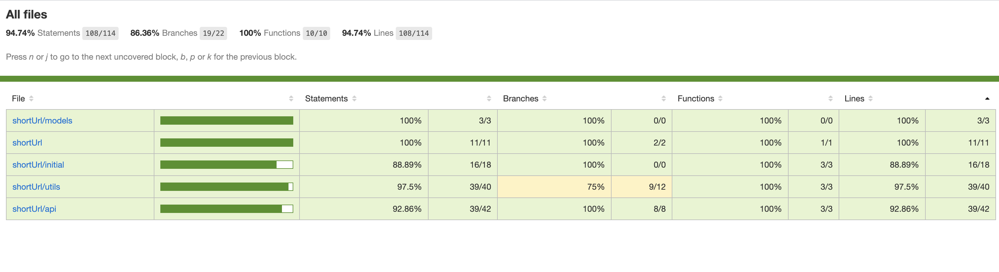

#### 项目


##### npm start

启动项目

Server running on  http://localhost:8080

##### npm test

自动化测试

##### npm run cover

自动化测试并计算覆盖率


#### 设计

##### 设计流程图

左边为「长链接转短链接」
右边为「短链接转长链接」


##### schema

在文件夹【model】中

#Url
```

_id: String [长链接url的md5编码]
url: String [原来的长链接]
code: String [短链接code id]

```

##### 长链接转短链接
```
1、将长链接进行md5编码
2、判断该md5在数据库中是否存在，如果存在则直接返回对应短链接
3、若不存在通过短链生成算法获取短链接
4、将md5值当作_id,与url和code字段存入数据库中，再返回对应短链接


# shortId 算法

1、使用当前的进程工作id进行62进制转换位字符串
2、通过当前服务器时间与一个时间的差值，如果该差值有相同，获取0～61中的随机数字进行62进制转换
3、通过该差值进行62进制转换字符串连接
4、如果当前字符串进过前三部连接没有超过6位，则随机补气其余位数

```

##### 短链接转长链接

```
1、获取请求链接中的短链接code id
2、从数据库中查询该code id是否存在，若不存在则报404错误
3、若存在则返回对应长链接id
```


#### 可能与扩展

```
1、将来可能扩展用户自定义的短链
2、数据统计（访问的 ip 地域、用户使用的设备、点击的次数等等）
3、后台管理删除，过期时间等等
4、短链访问权限管理（输密码、登陆访问等等）
5、...

```

#### 测试结果




#test express app /api/shortId/*

MongoDB Connected to: mongodb://localhost:27017/short-url
```
    ✓ #test get /api/shortId/?url=https://www.baidu.com/?q=r0aasf9anmi (45ms)
    ✓ #test get /api/shortId/?url=https://www.baidu.com/
    ✓ #test get /api/shortId/?url=1 404
    ✓ #test get /api/shortId/:code 200
    ✓ #test get /api/shortId/23823 404
    ✓ #test get /:code 301
    ✓ #test get /:1232130 404
```
  #test utils
```
    ✓ #test md5
    ✓ #test shortId
    ✓ #test index.js
```

#test-coverage

  11 passing (131ms)

```
---------------------|---------|----------|---------|---------|-------------------
File                 | % Stmts | % Branch | % Funcs | % Lines | Uncovered Line #s 
---------------------|---------|----------|---------|---------|-------------------
All files            |   94.74 |    86.36 |     100 |   94.74 |                   
 shortUrl            |     100 |      100 |     100 |     100 |                   
  app.js             |     100 |      100 |     100 |     100 |                   
  index.js           |     100 |      100 |     100 |     100 |                   
 shortUrl/api        |   92.86 |      100 |     100 |   92.86 |                   
  index.js           |   91.67 |      100 |     100 |   91.67 | 15                
  shortId.js         |   93.33 |      100 |     100 |   93.33 | 35,55             
 shortUrl/initial    |   88.89 |      100 |     100 |   88.89 |                   
  apiInitial.js      |     100 |      100 |     100 |     100 |                   
  index.js           |     100 |      100 |     100 |     100 |                   
  mongoInitial.js    |      80 |      100 |     100 |      80 | 16-17             
 shortUrl/models     |     100 |      100 |     100 |     100 |                   
  shortId.js         |     100 |      100 |     100 |     100 |                   
 shortUrl/utils      |    97.5 |       75 |     100 |    97.5 |                   
  cluster-work-id.js |      80 |       50 |     100 |      80 | 5                 
  logger.js          |     100 |      100 |     100 |     100 |                   
  md5.js             |     100 |      100 |     100 |     100 |                   
  short-id.js        |     100 |     87.5 |     100 |     100 | 29                
---------------------|---------|----------|---------|---------|-------------------
```